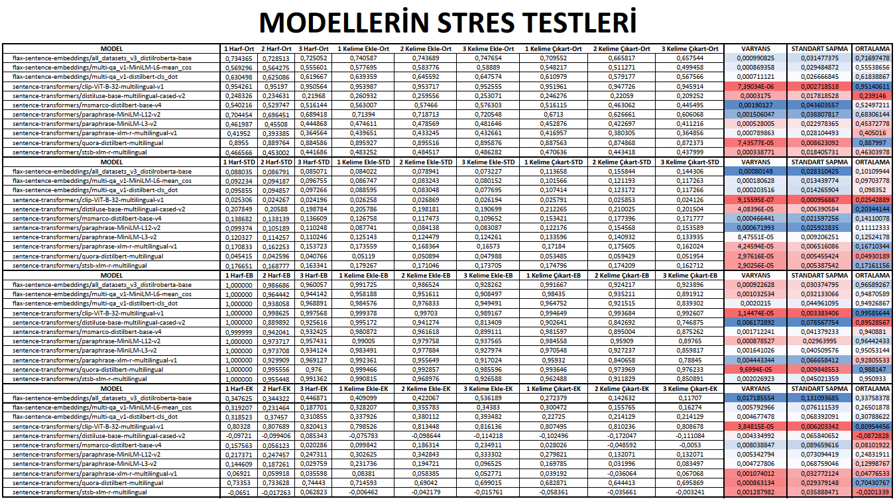
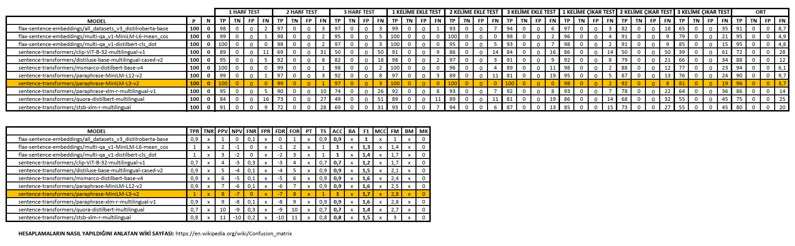
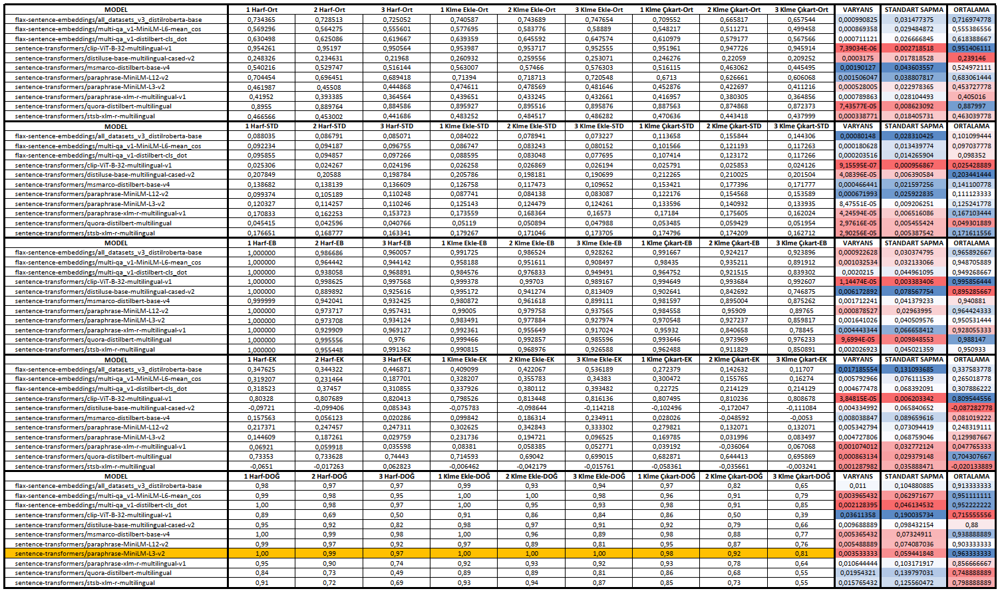

Kısaltmaların açılımı

Kısaltma | Açılım
---------|-------
STD | Standart Sapma
ORT | Ortalama
EB | En Büyük
EK | En küçük

olmak üzere ve

Sütünlar sırasıyla:

- 1 harf değiştirilmesi
- 2 harf değiştirilmesi
- 3 harf değiştirilmesi

---------------
- 1 kelime eklenmesi
- 2 kelime eklenmesi
- 3 kelime eklenmesi

----------------
- 1 kelime çıkartılması
- 2 kelime çıkartılması
- 3 kelime çıkartılması

olmak üzere, aşağıdaki tabloda 11 tane ön eğitilmiş modelin yapılan stres testine karşılık verdiği cevaplar yer almaktadır.

Kullanılabilirlik oranı, ***kırmızı*** renkten ***mavi*** renge giderek artmaktadır.

# Geliştirilmiş Stres Testi Sonuçları

