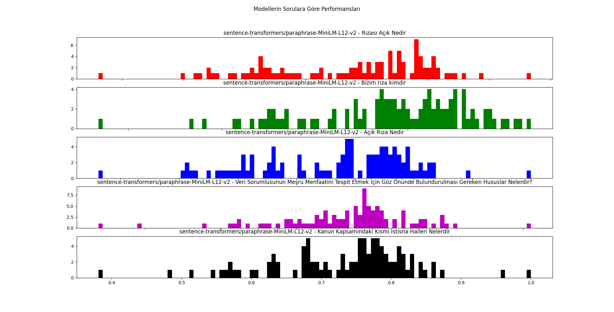
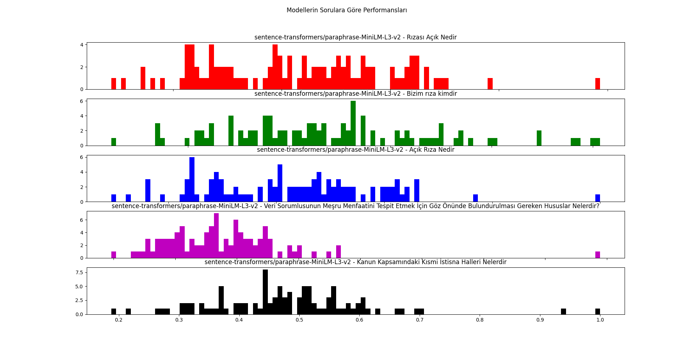
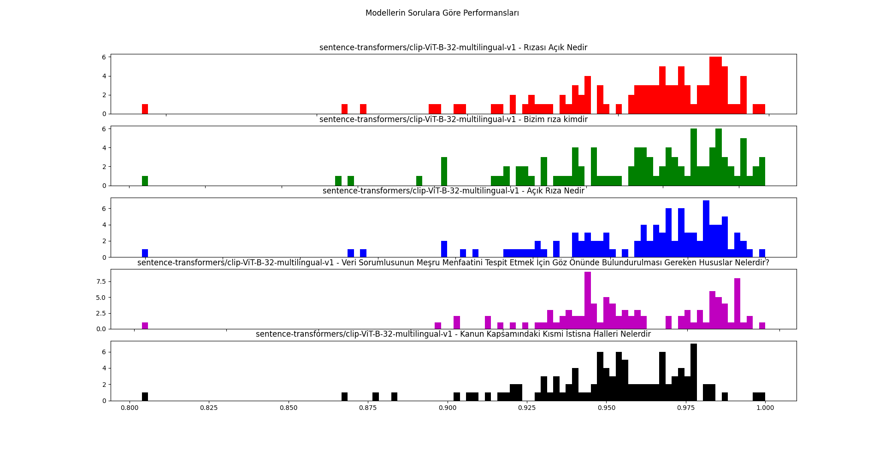
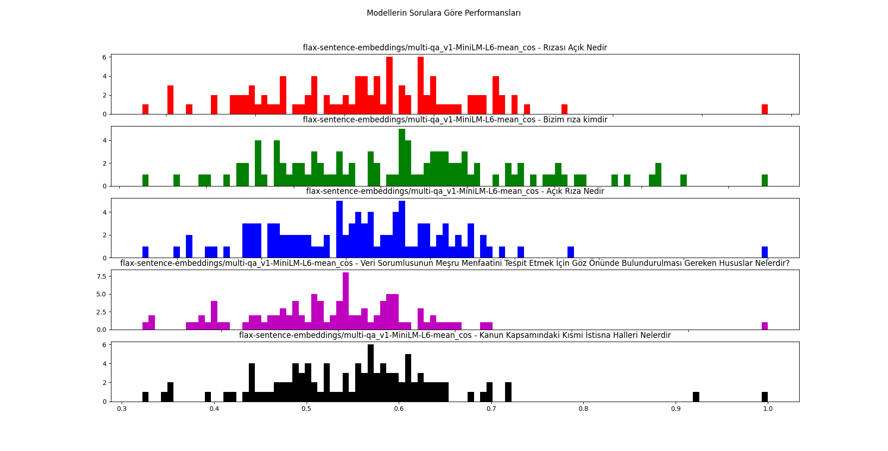

# Kişisel Verilerin Korunumu Kanunu Soru - Cevap Sistemi (Model Seçimi - Modellerin Performanslarının Testi ve Görselleri)
**Türkiye Açık Kaynak Platformu** tarafından **Türkçe Doğal Dil İşleme** konusunda farkındalık oluşturmak amacıyla 2021 yılında **TeknoFest 2021 İSTANBUL** kapsamında çevrimiçi düzenlenen yarışma için geliştirdiğimiz projemiz **Kişisel Verilerin Korunumu Kanunu (KVKK)** hakkindaki **sorulara cevap veren** otonom bir sohbet yazılımı / çağrı merkezidir.

## Modellerin Performanslarının Testi ve Görselleri
### sentence-transformers/paraphrase-xlm-r-multilingual-v1
#### Test sorusu:  Rızası Açık Nedir
- En yakın soru:  Açık Rıza Nedir
- En yakın sorunun benzerlik puanı:  0.7881278991699219
- 100 soru için standart sapma:  0.09031134114351157
- 100 soru için varyans:  0.008156138339139725
- 100 soru için en az benzerlik:  0.2061745971441269
- 100 soru için en çok benzerlik:  0.7881278991699219

#### Test sorusu:  Bizim rıza kimdir
- En yakın soru:  İlgili Kişi Kimdir
- En yakın sorunun benzerlik puanı:  0.6737094521522522
- 100 soru için standart sapma:  0.09481469722612126
- 100 soru için varyans:  0.008989826810081048
- 100 soru için en az benzerlik:  0.11326003819704056
- 100 soru için en çok benzerlik:  0.6737094521522522

#### Test sorusu:  Açık Rıza Nedir
- En yakın soru:  Açık Rıza Nedir
- En yakın sorunun benzerlik puanı:  0.999999463558197
- 100 soru için standart sapma:  0.10673250500966416
- 100 soru için varyans:  0.011391827625637984
- 100 soru için en az benzerlik:  0.22501610219478607
- 100 soru için en çok benzerlik:  0.999999463558197

#### Test sorusu:  Veri Sorumlusunun Meşru Menfaatini Tespit Etmek İçin Göz Önünde Bulundurulması Gereken Hususlar Nelerdir?
- En yakın soru:  Veri Sorumlusunun Meşru Menfaatini Tespit Etmek İçin Göz Önünde Bulundurulmas Gereken Hususlar Nelerdir
- En yakın sorunun benzerlik puanı:  0.9273832440376282
- 100 soru için standart sapma:  0.15095682736439872
- 100 soru için varyans:  0.022787963727924875
- 100 soru için en az benzerlik:  0.204115092754364
- 100 soru için en çok benzerlik:  0.9273832440376282

#### Test sorusu:  Kanun Kapsamındaki Kısmi İstisna Halleri Nelerdir
- En yakın soru:  Kanun Kapsamındaki Kısmi İstisna Halleri Nelerdir
- En yakın sorunun benzerlik puanı:  1.0000004768371582
- 100 soru için standart sapma:  0.14840829054213817
- 100 soru için varyans:  0.0220250207016397
- 100 soru için en az benzerlik:  0.10882505774497986
- 100 soru için en çok benzerlik:  1.0000004768371582

### sentence-transformers/paraphrase-MiniLM-L12-v2
#### Test sorusu:  Rızası Açık Nedir
- En yakın soru:  Açık Rıza Nedir
- En yakın sorunun benzerlik puanı:  0.9680424928665161
- 100 soru için standart sapma:  0.1317228053756749
- 100 soru için varyans:  0.017350897456037927
- 100 soru için en az benzerlik:  0.26128602027893066
- 100 soru için en çok benzerlik:  0.9680424928665161

#### Test sorusu:  Bizim rıza kimdir
- En yakın soru:  Açık Rıza Geri Alınabilir mi
- En yakın sorunun benzerlik puanı:  0.7322721481323242
- 100 soru için standart sapma:  0.08688951109034064
- 100 soru için varyans:  0.00754978713751843
- 100 soru için en az benzerlik:  0.2677695155143738
- 100 soru için en çok benzerlik:  0.7322721481323242

#### Test sorusu:  Açık Rıza Nedir
- En yakın soru:  Açık Rıza Nedir
- En yakın sorunun benzerlik puanı:  0.9999998807907104
- 100 soru için standart sapma:  0.13043351130436273
- 100 soru için varyans:  0.017012900871185323
- 100 soru için en az benzerlik:  0.2621586322784424
- 100 soru için en çok benzerlik:  0.9999998807907104

#### Test sorusu:  Veri Sorumlusunun Meşru Menfaatini Tespit Etmek İçin Göz Önünde Bulundurulması Gereken Hususlar Nelerdir?
- En yakın soru:  Veri Sorumlusunun Meşru Menfaatini Tespit Etmek İçin Göz Önünde Bulundurulmas Gereken Hususlar Nelerdir
- En yakın sorunun benzerlik puanı:  0.9101005792617798
- 100 soru için standart sapma:  0.0844180041982486
- 100 soru için varyans:  0.00712639943281552
- 100 soru için en az benzerlik:  0.3378963768482208
- 100 soru için en çok benzerlik:  0.9101005792617798

#### Test sorusu:  Kanun Kapsamındaki Kısmi İstisna Halleri Nelerdir
- En yakın soru:  Kanun Kapsamındaki Kısmi İstisna Halleri Nelerdir
- En yakın sorunun benzerlik puanı:  1.0000001192092896
- 100 soru için standart sapma:  0.0976982724292554
- 100 soru için varyans:  0.009544952435661004
- 100 soru için en az benzerlik:  0.3808857798576355
- 100 soru için en çok benzerlik:  1.0000001192092896

### sentence-transformers/paraphrase-MiniLM-L3-v2
#### Test sorusu:  Rızası Açık Nedir
- En yakın soru:  Açık Rıza Nedir
- En yakın sorunun benzerlik puanı:  0.986303448677063
- 100 soru için standart sapma:  0.16766864873826856
- 100 soru için varyans:  0.028112775769716884
- 100 soru için en az benzerlik:  0.08598922193050385
- 100 soru için en çok benzerlik:  0.986303448677063

#### Test sorusu:  Bizim rıza kimdir
- En yakın soru:  Açık Rıza Geri Alınabilir mi
- En yakın sorunun benzerlik puanı:  0.6073688268661499
- 100 soru için standart sapma:  0.1015547065322114
- 100 soru için varyans:  0.01031335841884358
- 100 soru için en az benzerlik:  0.12434351444244385
- 100 soru için en çok benzerlik:  0.6073688268661499

#### Test sorusu:  Açık Rıza Nedir
- En yakın soru:  Açık Rıza Nedir
- En yakın sorunun benzerlik puanı:  1.000000238418579
- 100 soru için standart sapma:  0.15614985774195528
- 100 soru için varyans:  0.02438277807283287
- 100 soru için en az benzerlik:  0.09413276612758636
- 100 soru için en çok benzerlik:  1.000000238418579

#### Test sorusu:  Veri Sorumlusunun Meşru Menfaatini Tespit Etmek İçin Göz Önünde Bulundurulması Gereken Hususlar Nelerdir?
- En yakın soru:  Veri Sorumlusunun Meşru Menfaatini Tespit Etmek İçin Göz Önünde Bulundurulmas Gereken Hususlar Nelerdir
- En yakın sorunun benzerlik puanı:  0.989203929901123
- 100 soru için standart sapma:  0.09872772783762052
- 100 soru için varyans:  0.00974716424397927
- 100 soru için en az benzerlik:  0.19603364169597626
- 100 soru için en çok benzerlik:  0.989203929901123

#### Test sorusu:  Kanun Kapsamındaki Kısmi İstisna Halleri Nelerdir
- En yakın soru:  Kanun Kapsamındaki Kısmi İstisna Halleri Nelerdir
- En yakın sorunun benzerlik puanı:  1.0000003576278687
- 100 soru için standart sapma:  0.12472795777975887
- 100 soru için varyans:  0.015557063451909312
- 100 soru için en az benzerlik:  0.18743488192558289
- 100 soru için en çok benzerlik:  1.0000003576278687

### sentence-transformers/clip-ViT-B-32-multilingual-v1
#### Test sorusu:  Rızası Açık Nedir
- En yakın soru:  Açık Rıza Nedir
- En yakın sorunun benzerlik puanı:  0.998851478099823
- 100 soru için standart sapma:  0.033195733145343534
- 100 soru için varyans:  0.0011019566990568593
- 100 soru için en az benzerlik:  0.7920548319816589
- 100 soru için en çok benzerlik:  0.998851478099823

#### Test sorusu:  Bizim rıza kimdir
- En yakın soru:  Kurumun Görevleri Nelerdir
- En yakın sorunun benzerlik puanı:  0.9836572408676147
- 100 soru için standart sapma:  0.034604810653086016
- 100 soru için varyans:  0.0011974929203359354
- 100 soru için en az benzerlik:  0.7791657447814941
- 100 soru için en çok benzerlik:  0.9836572408676147

#### Test sorusu:  Açık Rıza Nedir
- En yakın soru:  Açık Rıza Nedir
- En yakın sorunun benzerlik puanı:  0.9999998211860657
- 100 soru için standart sapma:  0.031402886998495055
- 100 soru için varyans:  0.0009861413118402496
- 100 soru için en az benzerlik:  0.7989063262939453
- 100 soru için en çok benzerlik:  0.9999998211860657

#### Test sorusu:  Veri Sorumlusunun Meşru Menfaatini Tespit Etmek İçin Göz Önünde Bulundurulması Gereken Hususlar Nelerdir?
- En yakın soru:  Veri Sorumlusunun Meşru Menfaatini Tespit Etmek İçin Göz Önünde Bulundurulmas Gereken Hususlar Nelerdir
- En yakın sorunun benzerlik puanı:  0.9961882829666138
- 100 soru için standart sapma:  0.02492323103595429
- 100 soru için varyans:  0.000621167445271555
- 100 soru için en az benzerlik:  0.8270413875579834
- 100 soru için en çok benzerlik:  0.9961882829666138

#### Test sorusu:  Kanun Kapsamındaki Kısmi İstisna Halleri Nelerdir
- En yakın soru:  Kanun Kapsamındaki Kısmi İstisna Halleri Nelerdir
- En yakın sorunun benzerlik puanı:  1.0000003576278687
- 100 soru için standart sapma:  0.02832038463617516
- 100 soru için varyans:  0.0008020441859409061
- 100 soru için en az benzerlik:  0.8038846254348755
- 100 soru için en çok benzerlik:  1.0000003576278687

### sentence-transformers/distiluse-base-multilingual-cased-v2
#### Test sorusu:  Rızası Açık Nedir
- En yakın soru:  Açık Rıza Nedir
- En yakın sorunun benzerlik puanı:  0.9775306582450867
- 100 soru için standart sapma:  0.15774249927335074
- 100 soru için varyans:  0.024882696077003056
- 100 soru için en az benzerlik:  0.06282320618629456
- 100 soru için en çok benzerlik:  0.9775306582450867

#### Test sorusu:  Bizim rıza kimdir
- En yakın soru:  Veri İşleyen Kimdir
- En yakın sorunun benzerlik puanı:  0.7705034613609314
- 100 soru için standart sapma:  0.13218867052091213
- 100 soru için varyans:  0.017473844614086263
- 100 soru için en az benzerlik:  0.03536630794405937
- 100 soru için en çok benzerlik:  0.7705034613609314

#### Test sorusu:  Açık Rıza Nedir
- En yakın soru:  Açık Rıza Nedir
- En yakın sorunun benzerlik puanı:  1.000000238418579
- 100 soru için standart sapma:  0.15974316018306167
- 100 soru için varyans:  0.025517877225271303
- 100 soru için en az benzerlik:  0.05849368870258331
- 100 soru için en çok benzerlik:  1.000000238418579

#### Test sorusu:  Veri Sorumlusunun Meşru Menfaatini Tespit Etmek İçin Göz Önünde Bulundurulması Gereken Hususlar Nelerdir?
- En yakın soru:  Veri Sorumlusunun Meşru Menfaatini Tespit Etmek İçin Göz Önünde Bulundurulmas Gereken Hususlar Nelerdir
- En yakın sorunun benzerlik puanı:  0.7402418851852417
- 100 soru için standart sapma:  0.11794944102643293
- 100 soru için varyans:  0.013912070638447979
- 100 soru için en az benzerlik:  0.036321915686130524
- 100 soru için en çok benzerlik:  0.7402418851852417

#### Test sorusu:  Kanun Kapsamındaki Kısmi İstisna Halleri Nelerdir
- En yakın soru:  Kanun Kapsamındaki Kısmi İstisna Halleri Nelerdir
- En yakın sorunun benzerlik puanı:  1.0
- 100 soru için standart sapma:  0.14973112249078244
- 100 soru için varyans:  0.022419409042349698
- 100 soru için en az benzerlik:  0.06083931773900986
- 100 soru için en çok benzerlik:  1.0

### sentence-transformers/quora-distilbert-multilingual
#### Test sorusu:  Rızası Açık Nedir
- En yakın soru:  Açık Rıza Nedir
- En yakın sorunun benzerlik puanı:  0.9785324335098267
- 100 soru için standart sapma:  0.032612705690137175
- 100 soru için varyans:  0.0010635885724315055
- 100 soru için en az benzerlik:  0.81768798828125
- 100 soru için en çok benzerlik:  0.9785324335098267

#### Test sorusu:  Bizim rıza kimdir
- En yakın soru:  Veri İşleyen Kimdir
- En yakın sorunun benzerlik puanı:  0.957028865814209
- 100 soru için standart sapma:  0.03432519518250269
- 100 soru için varyans:  0.0011782190243169058
- 100 soru için en az benzerlik:  0.8012716770172119
- 100 soru için en çok benzerlik:  0.957028865814209

#### Test sorusu:  Açık Rıza Nedir
- En yakın soru:  Açık Rıza Nedir
- En yakın sorunun benzerlik puanı:  1.000000238418579
- 100 soru için standart sapma:  0.03474960407296372
- 100 soru için varyans:  0.001207534983227737
- 100 soru için en az benzerlik:  0.8180021643638611
- 100 soru için en çok benzerlik:  1.000000238418579

#### Test sorusu:  Veri Sorumlusunun Meşru Menfaatini Tespit Etmek İçin Göz Önünde Bulundurulması Gereken Hususlar Nelerdir?
- En yakın soru:  Veri Sorumlusunun Meşru Menfaatini Tespit Etmek İçin Göz Önünde Bulundurulmas Gereken Hususlar Nelerdir
- En yakın sorunun benzerlik puanı:  0.9941577911376953
- 100 soru için standart sapma:  0.027771689753036306
- 100 soru için varyans:  0.0007712667517389018
- 100 soru için en az benzerlik:  0.8240141868591309
- 100 soru için en çok benzerlik:  0.9941577911376953

#### Test sorusu:  Kanun Kapsamındaki Kısmi İstisna Halleri Nelerdir
- En yakın soru:  Kanun Kapsamındaki Kısmi İstisna Halleri Nelerdir
- En yakın sorunun benzerlik puanı:  1.0000003576278687
- 100 soru için standart sapma:  0.03696539863360474
- 100 soru için varyans:  0.0013664406961413072
- 100 soru için en az benzerlik:  0.8337475061416626
- 100 soru için en çok benzerlik:  1.0000003576278687

### sentence-transformers/msmarco-distilbert-base-v4
#### Test sorusu:  Rızası Açık Nedir
- En yakın soru:  Açık Rıza Nedir
- En yakın sorunun benzerlik puanı:  0.9687042236328125
- 100 soru için standart sapma:  0.11930453850539209
- 100 soru için varyans:  0.014233572907984585
- 100 soru için en az benzerlik:  0.2017299234867096
- 100 soru için en çok benzerlik:  0.9687042236328125

#### Test sorusu:  Bizim rıza kimdir
- En yakın soru:  Açık Rıza Geri Alınabilir mi
- En yakın sorunun benzerlik puanı:  0.6291718482971191
- 100 soru için standart sapma:  0.08554289152308699
- 100 soru için varyans:  0.007317586290130627
- 100 soru için en az benzerlik:  0.21877333521842957
- 100 soru için en çok benzerlik:  0.6291718482971191

#### Test sorusu:  Açık Rıza Nedir
- En yakın soru:  Açık Rıza Nedir
- En yakın sorunun benzerlik puanı:  0.9999997615814209
- 100 soru için standart sapma:  0.12072566264428186
- 100 soru için varyans:  0.014574685620900953
- 100 soru için en az benzerlik:  0.20971032977104187
- 100 soru için en çok benzerlik:  0.9999997615814209

#### Test sorusu:  Veri Sorumlusunun Meşru Menfaatini Tespit Etmek İçin Göz Önünde Bulundurulması Gereken Hususlar Nelerdir?
- En yakın soru:  Veri Sorumlusunun Meşru Menfaatini Tespit Etmek İçin Göz Önünde Bulundurulmas Gereken Hususlar Nelerdir
- En yakın sorunun benzerlik puanı:  0.9785761833190918
- 100 soru için standart sapma:  0.11666071245900513
- 100 soru için varyans:  0.013609721831442675
- 100 soru için en az benzerlik:  0.268890917301178
- 100 soru için en çok benzerlik:  0.9785761833190918

#### Test sorusu:  Kanun Kapsamındaki Kısmi İstisna Halleri Nelerdir
- En yakın soru:  Kanun Kapsamındaki Kısmi İstisna Halleri Nelerdir
- En yakın sorunun benzerlik puanı:  0.9999999403953552
- 100 soru için standart sapma:  0.11330854980609552
- 100 soru için varyans:  0.012838827459160429
- 100 soru için en az benzerlik:  0.27136218547821045
- 100 soru için en çok benzerlik:  0.9999999403953552

### flax-sentence-embeddings/multi-qa_v1-distilbert-cls_dot
#### Test sorusu:  Rızası Açık Nedir
- En yakın soru:  Açık Rıza Nedir
- En yakın sorunun benzerlik puanı:  0.9727213382720947
- 100 soru için standart sapma:  0.09999333938603502
- 100 soru için varyans:  0.009998667921570784
- 100 soru için en az benzerlik:  0.3637577295303345
- 100 soru için en çok benzerlik:  0.9727213382720947

#### Test sorusu:  Bizim rıza kimdir
- En yakın soru:  Veri Sorumlusu Kimdir
- En yakın sorunun benzerlik puanı:  0.7269015312194824
- 100 soru için standart sapma:  0.0682536680081209
- 100 soru için varyans:  0.004658563196562786
- 100 soru için en az benzerlik:  0.3903673589229584
- 100 soru için en çok benzerlik:  0.7269015312194824

#### Test sorusu:  Açık Rıza Nedir
- En yakın soru:  Açık Rıza Nedir
- En yakın sorunun benzerlik puanı:  0.9999995827674866
- 100 soru için standart sapma:  0.0984753707905208
- 100 soru için varyans:  0.009697398652330557
- 100 soru için en az benzerlik:  0.3740743100643158
- 100 soru için en çok benzerlik:  0.9999995827674866

#### Test sorusu:  Veri Sorumlusunun Meşru Menfaatini Tespit Etmek İçin Göz Önünde Bulundurulması Gereken Hususlar Nelerdir?
- En yakın soru:  Veri Sorumlusunun Meşru Menfaatini Tespit Etmek İçin Göz Önünde Bulundurulmas Gereken Hususlar Nelerdir
- En yakın sorunun benzerlik puanı:  0.967589259147644
- 100 soru için standart sapma:  0.07717351659551215
- 100 soru için varyans:  0.00595575166371779
- 100 soru için en az benzerlik:  0.4554002285003662
- 100 soru için en çok benzerlik:  0.967589259147644

#### Test sorusu:  Kanun Kapsamındaki Kısmi İstisna Halleri Nelerdir
- En yakın soru:  Kanun Kapsamındaki Kısmi İstisna Halleri Nelerdir
- En yakın sorunun benzerlik puanı:  0.9999997019767761
- 100 soru için standart sapma:  0.07563637016156921
- 100 soru için varyans:  0.0057208604912179165
- 100 soru için en az benzerlik:  0.49159836769104004
- 100 soru için en çok benzerlik:  0.9999997019767761

### flax-sentence-embeddings/all_datasets_v3_distilroberta-base
#### Test sorusu:  Rızası Açık Nedir
- En yakın soru:  Açık Rıza Nedir
- En yakın sorunun benzerlik puanı:  0.9475945830345154
- 100 soru için standart sapma:  0.09370164333544964
- 100 soru için varyans:  0.008779997963763813
- 100 soru için en az benzerlik:  0.3742283582687378
- 100 soru için en çok benzerlik:  0.9475945830345154

#### Test sorusu:  Bizim rıza kimdir
- En yakın soru:  Açık Rıza Geri Alınabilir mi
- En yakın sorunun benzerlik puanı:  0.745851457118988
- 100 soru için standart sapma:  0.07434146708125557
- 100 soru için varyans:  0.005526653727793404
- 100 soru için en az benzerlik:  0.35091596841812134
- 100 soru için en çok benzerlik:  0.745851457118988

#### Test sorusu:  Açık Rıza Nedir
- En yakın soru:  Açık Rıza Nedir
- En yakın sorunun benzerlik puanı:  1.0000001192092896
- 100 soru için standart sapma:  0.10642340128796242
- 100 soru için varyans:  0.011325940341698681
- 100 soru için en az benzerlik:  0.3199058175086975
- 100 soru için en çok benzerlik:  1.0000001192092896

#### Test sorusu:  Veri Sorumlusunun Meşru Menfaatini Tespit Etmek İçin Göz Önünde Bulundurulması Gereken Hususlar Nelerdir?
- En yakın soru:  Veri Sorumlusunun Meşru Menfaatini Tespit Etmek İçin Göz Önünde Bulundurulmas Gereken Hususlar Nelerdir
- En yakın sorunun benzerlik puanı:  0.9467079639434814
- 100 soru için standart sapma:  0.07514548157879682
- 100 soru için varyans:  0.005646843401709292
- 100 soru için en az benzerlik:  0.4490310549736023
- 100 soru için en çok benzerlik:  0.9467079639434814

#### Test sorusu:  Kanun Kapsamındaki Kısmi İstisna Halleri Nelerdir
- En yakın soru:  Kanun Kapsamındaki Kısmi İstisna Halleri Nelerdir
- En yakın sorunun benzerlik puanı:  0.9999998807907104
- 100 soru için standart sapma:  0.08680794117644318
- 100 soru için varyans:  0.007535618651292818
- 100 soru için en az benzerlik:  0.4559641480445862
- 100 soru için en çok benzerlik:  0.9999998807907104

### flax-sentence-embeddings/multi-qa_v1-MiniLM-L6-mean_cos
#### Test sorusu:  Rızası Açık Nedir
- En yakın soru:  Açık Rıza Nedir
- En yakın sorunun benzerlik puanı:  0.9736274480819702
- 100 soru için standart sapma:  0.11332337345342353
- 100 soru için varyans:  0.012842186970864096
- 100 soru için en az benzerlik:  0.2735217809677124
- 100 soru için en çok benzerlik:  0.9736274480819702

#### Test sorusu:  Bizim rıza kimdir
- En yakın soru:  Kurul Kimler Hakkında İdari Yaptırım Kararı Verebilir
- En yakın sorunun benzerlik puanı:  0.6226543188095093
- 100 soru için standart sapma:  0.0704544242429371
- 100 soru için varyans:  0.004963825895403764
- 100 soru için en az benzerlik:  0.2631136476993561
- 100 soru için en çok benzerlik:  0.6226543188095093

#### Test sorusu:  Açık Rıza Nedir
- En yakın soru:  Açık Rıza Nedir
- En yakın sorunun benzerlik puanı:  1.0
- 100 soru için standart sapma:  0.1111880375799492
- 100 soru için varyans:  0.012362779700880197
- 100 soru için en az benzerlik:  0.25873076915740967
- 100 soru için en çok benzerlik:  1.0

#### Test sorusu:  Veri Sorumlusunun Meşru Menfaatini Tespit Etmek İçin Göz Önünde Bulundurulması Gereken Hususlar Nelerdir?
- En yakın soru:  Veri Sorumlusunun Meşru Menfaatini Tespit Etmek İçin Göz Önünde Bulundurulmas Gereken Hususlar Nelerdir
- En yakın sorunun benzerlik puanı:  0.9680929183959961
- 100 soru için standart sapma:  0.07477344996668212
- 100 soru için varyans:  0.0055910688199199135
- 100 soru için en az benzerlik:  0.4322972595691681
- 100 soru için en çok benzerlik:  0.9680929183959961

#### Test sorusu:  Kanun Kapsamındaki Kısmi İstisna Halleri Nelerdir
- En yakın soru:  Kanun Kapsamındaki Kısmi İstisna Halleri Nelerdir
- En yakın sorunun benzerlik puanı:  1.0000001192092896
- 100 soru için standart sapma:  0.10091413082635198
- 100 soru için varyans:  0.010183661800438082
- 100 soru için en az benzerlik:  0.3221564292907715
- 100 soru için en çok benzerlik:  1.0000001192092896

### sentence-transformers/stsb-xlm-r-multilingual
#### Test sorusu:  Rızası Açık Nedir
- En yakın soru:  Açık Rıza Nedir
- En yakın sorunun benzerlik puanı:  0.8981062769889832
- 100 soru için standart sapma:  0.13457592513566421
- 100 soru için varyans:  0.018110679626119897
- 100 soru için en az benzerlik:  0.16311761736869812
- 100 soru için en çok benzerlik:  0.8981062769889832

#### Test sorusu:  Bizim rıza kimdir
- En yakın soru:  İlgili Kişi Kimdir
- En yakın sorunun benzerlik puanı:  0.8571369647979736
- 100 soru için standart sapma:  0.11419975105479173
- 100 soru için varyans:  0.013041583140976405
- 100 soru için en az benzerlik:  0.179180309176445
- 100 soru için en çok benzerlik:  0.8571369647979736

#### Test sorusu:  Açık Rıza Nedir
- En yakın soru:  Açık Rıza Nedir
- En yakın sorunun benzerlik puanı:  1.0
- 100 soru için standart sapma:  0.12558606072054565
- 100 soru için varyans:  0.01577185864730458
- 100 soru için en az benzerlik:  0.13621072471141815
- 100 soru için en çok benzerlik:  1.0

#### Test sorusu:  Veri Sorumlusunun Meşru Menfaatini Tespit Etmek İçin Göz Önünde Bulundurulması Gereken Hususlar Nelerdir?
- En yakın soru:  Veri Sorumlusunun Meşru Menfaatini Tespit Etmek İçin Göz Önünde Bulundurulmas Gereken Hususlar Nelerdir
- En yakın sorunun benzerlik puanı:  0.9530796408653259
- 100 soru için standart sapma:  0.1672054314634673
- 100 soru için varyans:  0.02795765631088426
- 100 soru için en az benzerlik:  0.05470217019319534
- 100 soru için en çok benzerlik:  0.9530796408653259

#### Test sorusu:  Kanun Kapsamındaki Kısmi İstisna Halleri Nelerdir
- En yakın soru:  Açık Rıza Nedir
- En yakın sorunun benzerlik puanı:  1.0
- 100 soru için standart sapma:  0.15608889536506473
- 100 soru için varyans:  0.024363743256286128
- 100 soru için en az benzerlik:  0.052809566259384155
- 100 soru için en çok benzerlik:  1.0

