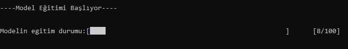
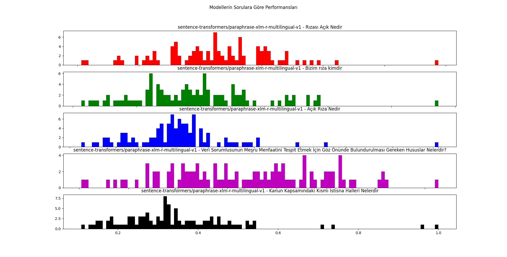
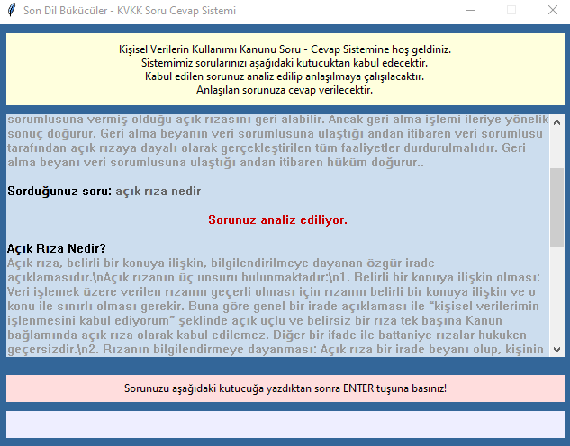

# Kişisel Verilerin Korunumu Kanunu Soru - Cevap Sistemi
**Türkiye Açık Kaynak Platformu** tarafından **Türkçe Doğal Dil İşleme** konusunda farkındalık oluşturmak amacıyla 2021 yılında **TeknoFest 2021 İSTANBUL** kapsamında çevrimiçi düzenlenen yarışma için geliştirdiğimiz projemiz **Kişisel Verilerin Korunumu Kanunu (KVKK)** hakkindaki **sorulara cevap veren** otonom bir sohbet yazılımı / çağrı merkezidir.

## Soru Cevap Sisteminin Parçaları
### Model Eğitimi
- Projede kullandığımız ana model _(sentence-transformers/paraphrase-xlm-r-multilingual-v1)_ cümle benzerliğinin bulunmasında kullanılan bir modeldir.
- Ana model olarak kullandığımız RoBERTa modeli A Robustly Optimized BERT Pretraining Approach olarak anılır ve Yinhan Liu, Myle Ott, Naman Goyal, Jingfei Du, Mandar Joshi, Danqi Chen, Omer Levy, Mike Lewis, Luke Zettlemoyer ve Veselin Stoyanov tarafından Google’ın 2018 BERT modeli referans alınarak yapılmıştır.
- Kullandığımız ana modele ve API uygulamasına https://huggingface.co/sentence-transformers/paraphrase-xlm-r-multilingual-v1 İnternet sayfasından ulaşabilirsiniz.
- Mevcut Modelimizi kendi veri kümeniz ile eğitebilmeniz için hazırladığımız bir PYTHON dosyamız mevcuttur. __*/ModelEgitimiYeniYontem.py*__ isimli dosyamız TSV (Tab-Separated Values) içerikli metin dosyasından ikişer satır okuyup modele eğitim için göndermektedir. Mevcut veri kümenizi saklama biçiminize göre __*def sorulariDosyadanOkuveListeOlarakDondur(son):*__ isimli fonksiyonu değiştirmeniz gerekir.

##### Model Eğitimi İçin Kullanılan Kütüphaneler
- torch (GPU kullanımı için)
- pandas (Veri çerçevesi kullanmak için)
- transformers (ön eğitilmiş modelin kullanılması ve farklı bir problem için tekrar eğitilmesi için kullanılan mimariyi eklemek için)
- warnings (gereksiz uyarıları kapatmak için)
- time (süre hesabı ve rastgele sayı üretimi için)
- tqdm (ilerleme çubuğu oluşturmak için)

#### Model Eğitiminde GPU Varsa Kullanmak İçin
- Kullandığınız bilgisayarda modelinizi eğitmek için GPU varsa o GPU'yu kullanmak için
> device = torch.device("cuda:0") if torch.cuda.is_available() else torch.device("cpu") 
- GPU'da yapmak istediğiniz hesaplama / işlem için
> nesneyi .to(device) metodu ile kendine eşitlemeniz gerekmektedir.
> Örneğin, model = model.to(device)

- Daha detaylı kullanım için aşağıdaki torch komutları incelenebilir. 
> if torch.cuda.is_available():

> torch.cuda.current_device()

> torch.cuda.device(0)

> torch.cuda.device_count()

> torch.cuda.get_device_name(0)

### Modelimizi İyileştirdiğimiz Veri Kümemiz
- Mevcut Modelimizi KVKK kapsamında oluşturduğumuz 100 soru ve bu sorulara verilebilecek cevaplar ile eğittik.
- Veri kümemiz model eğitimimizin yanında metin benzerliği ile tespit ettiğimiz cevapların saklandığı (**_KVKK_100_SORU_CEVAP.txt_**) bir metin dosyasıdır.
- Soru numarası, soru ve cevap olmak üzere 3 sütun ve 101 satırdan oluşmaktadır. Satırdaki her bir kayıt alanı sekme ile ayrılmıştır (TSV).

#### Veri Kümemizin İlk 4 Satırı (Başlık Satırı Dahil)
SN | Soru | Cevap
--- | ------------- | -------------
1 | Kişisel Verilerin Korunmasına Neden İhtiyaç Duyulmuştur | Gerek kamu, gerekse özel kurum ve kuruluşlar, bir görevin yerine getirilmesi veya bir hizmetin sunumuyla bağlantılı olarak, kişisel veri niteliğindeki bilgileri, uzun süredir toplamaktadırlar. Bu durum, bazen kanunlardan kaynaklanmakta bazen kişilerin rızasına veya bir sözleşmeye dayanmakta bazen de yapılan işlemin niteliğine bağlı olarak ortaya çıkmaktadır. Belirtmek gerekir ki, kişilerin temel hak ve hürriyetlerinin veri işleme sürecinde de korunması öncelikli konulardan biridir.\nAyrıca, sosyal ve ekonomik hayatın düzen içinde sürdürülmesi, kamu hizmetlerinin etkin biçimde sunumu, mal ve hizmetlerin ekonominin gereklerine uygun biçimde geliştirilmesi, dağıtımı ve pazarlanması için kişisel verilerin toplanması kaçınılmaz olmakla birlikte, kişisel verilerin sınırsız ve gelişigüzel toplanmasının, yetkisiz kişilerin erişimine açılmasının, ifşası, amaç dışı ya da kötüye kullanımı sonucu kişisel hakların ihlal edilmesinin önüne geçilmesi gereklidir.\nBunun yanı sıra, Avrupa Konseyi tarafından, tüm üye ülkelerde kişisel verilerin aynı standartlarda korunması ve sınır ötesi veri akışı ilkelerinin belirlenmesi amacıyla hazırlanan “Kişisel Verilerin Otomatik İşleme Tabi Tutulması Karşısında Bireylerin Korunmasına İlişkin 108 Sayılı Sözleşme”, 28 Ocak 1981 tarihinde imzaya açılmış ve ülkemiz tarafından da imzalanmıştır. Bu sözleşme 17 Mart 2016 tarih ve 29656 sayılı Resmî Gazetede yayımlanarak iç hukuka dâhil edilmiştir. 108 sayılı Sözleşmenin 4. maddesi çerçevesinde,9 iç hukukta kişisel verilerin korunmasına yönelik yasal düzenleme yapılması gerekli hale gelmiştir.\nNitekim, Anayasa Mahkemesinin 9 Nisan 2014 tarih ve E:2013/122, K:2014/74 sayılı kararında da; “Kişisel verilerin korunması hakkı, kişinin insan onurunun korunmasının ve kişiliğini serbestçe geliştirebilmesi hakkının özel bir biçimi olarak, bireyin hak ve özgürlüklerini kişisel verilerin işlenmesi sırasında korumayı […]” amaçladığı tespit edilerek, “kişisel verilerin ticari işletmeler için kıymetli bir varlık niteliği kazanması neticesinde, özel sektör unsurlarınca yaratılan risklerin daha yaygın ve önemli boyutlara ulaşması ve terör ve suç örgütlerinin kişisel verileri ele geçirme yönündeki faaliyetlerinin artması gibi etkenler” sebebiyle kişisel verilerin geçmişte olduğundan çok daha fazla korunmaya muhtaç olduğu ifade edilmiştir.
2 | Kişisel Verilerin Korunması Hakkının Dayanağı Nedir ve Bu Hak Sınırsız Bir Hak mıdır | 2010 yılında yapılan Anayasa değişikliği ile Anayasanın özel hayatın gizliliğini düzenleyen 20. maddesine “Herkes, kendisiyle ilgili kişisel verilerin korunmasını isteme hakkına sahiptir. Bu hak; kişinin kendisiyle ilgili kişisel verileri hakkında bilgilendirilme, bu verilere erişme, bunların düzeltilmesini veya silinmesini talep etme ve amaçları doğrultusunda kullanılıp kullanılmadığını öğrenmeyi de kapsar. Kişisel veriler, ancak Kanunda öngörülen hallerde veya kişinin açık rızasıyla işlenebilir. Kişisel verilerin korunmasına ilişkin esas ve usuller kanunla düzenlenir” şeklinde bir fıkra eklenerek, kişisel verilerin korunması açıkça anayasal güvence altına alınmıştır.\nTemel bir hak olarak düzenlenen kişisel verilerin korunmasını isteme hakkı, Anayasanın kişinin hak ve ödevlerine ilişkin bölümünde yer almaktadır. Bununla birlikte, tüm hak ve özgürlüklerde olduğu gibi, kişisel verilerin korunmasına ilişkin hak da Anayasada çizilen sınırlar çerçevesinde diğer hak ve özgürlükler lehine sınırlandırılabilir. Buna göre, kişisel verilerin korunmasına ilişkin 20. maddede tanınan her bir hakkın uygulanması ve diğer haklar lehine sınırlanmasına ilişkin düzenlemeler ancak kanun yoluyla gerçekleştirilebilir.
3 | Kişisel Verilerin Korunması Kanunu Ne Zaman Yürürlüğe Girmiştir | Kişisel Verilerin Korunması Kanunu Ne Zaman Yürürlüğe Girmiştir	Avrupa Birliğine uyum kapsamında hazırlanan Kişisel Verilerin Korunması Kanunu Tasarısı 18 Ocak 2016 tarihinde TBMM Başkanlığına sevk edilmiştir.\nSöz konusu metin 24 Mart 2016 tarihinde TBMM Genel Kurulu tarafından kabul edilerek kanunlaşmış ve 7 Nisan 2016 tarih ve 29677 sayılı Resmî Gazetede yayımlanarak yürürlüğe girmiştir.

### Model Testleri
- Modelimizi __*/KVKK_Model_Test.py*__ ile test ettik ve aşağıdaki örnek sonuçlara ulaştık.

__MODELLERİN TEST SORULARINA GÖRE PERFORMANSLARI__

Modeller/Sorular | Rızası Açık Nedir | Bizim rıza kimdir | Açık Rıza Nedir | Veri Sorumlusunun Meşru Menfaatini Tespit Etmek İçin Göz Önünde Bulundurulması Gereken Hususlar Nelerdir? | Kanun Kapsamındaki Kısmi İstisna Halleri Nelerdir
--- | --- | --- | --- | --- | ---
Model:  sentence-transformers/paraphrase-xlm-r-multilingual-v1 | Açık Rıza Nedir | İlgili Kişi Kimdir | Açık Rıza Nedir | Veri Sorumlusunun Meşru Menfaatini Tespit Etmek İçin Göz Önünde Bulundurulmas Gereken Hususlar Nelerdir | Kanun Kapsamındaki Kısmi İstisna Halleri Nelerdir
Model:  sentence-transformers/paraphrase-xlm-r-multilingual-v1 | 0.3555 | 0.4239 | 0.3629 | 0.4229 | 0.3816
Model:  sentence-transformers/paraphrase-MiniLM-L12-v2 | Açık Rıza Nedir | Açık Rıza Geri Alınabilir mi | Açık Rıza Nedir | Veri Sorumlusunun Meşru Menfaatini Tespit Etmek İçin Göz Önünde Bulundurulmas Gereken Hususlar Nelerdir | Kanun Kapsamındaki Kısmi İstisna Halleri Nelerdir
Model:  sentence-transformers/paraphrase-MiniLM-L12-v2 | 0.7051 | 0.7795 | 0.6962 | 0.8126 | 0.7811
Model:  sentence-transformers/paraphrase-MiniLM-L3-v2 | Açık Rıza Nedir | Açık Rıza Geri Alınabilir mi | Açık Rıza Nedir | Veri Sorumlusunun Meşru Menfaatini Tespit Etmek İçin Göz Önünde Bulundurulmas Gereken Hususlar Nelerdir | Kanun Kapsamındaki Kısmi İstisna Halleri Nelerdir
Model:  sentence-transformers/paraphrase-MiniLM-L3-v20.4516 | 0.6963 | 0.3841 | 0.5229 | 0.4440
Model:  sentence-transformers/clip-ViT-B-32-multilingual-v1 | Açık Rıza Nedir | Kurumun Görevleri Nelerdir | Açık Rıza Nedir | Veri Sorumlusunun Meşru Menfaatini Tespit Etmek İçin Göz Önünde Bulundurulmas Gereken Hususlar Nelerdir | Kanun Kapsamındaki Kısmi İstisna Halleri Nelerdir
Model:  sentence-transformers/clip-ViT-B-32-multilingual-v1 | 0.9610 | 0.9142 | 0.9402 | 0.9326 | 0.9401
Model:  sentence-transformers/distiluse-base-multilingual-cased-v2 | Açık Rıza Nedir | Veri İşleyen Kimdir | Açık Rıza Nedir | Veri Sorumlusunun Meşru Menfaatini Tespit Etmek İçin Göz Önünde Bulundurulmas Gereken Hususlar Nelerdir | Kanun Kapsamındaki Kısmi İstisna Halleri Nelerdir
Model:  sentence-transformers/distiluse-base-multilingual-cased-v2 | 0.3595 | 0.2548 | 0.2566 | 0.4041 | 0.2621
Model:  sentence-transformers/quora-distilbert-multilingual | Açık Rıza Nedir | Veri İşleyen Kimdir | Açık Rıza Nedir | Veri Sorumlusunun Meşru Menfaatini Tespit Etmek İçin Göz Önünde Bulundurulmas Gereken Hususlar Nelerdir | Kanun Kapsamındaki Kısmi İstisna Halleri Nelerdir
Model:  sentence-transformers/quora-distilbert-multilingual | 0.9034 | 0.8758 | 0.8870 | 0.8698 | 0.8627
Model:  sentence-transformers/msmarco-distilbert-base-v4 | Açık Rıza Nedir | Açık Rıza Geri Alınabilir mi | Açık Rıza Nedir | Veri Sorumlusunun Meşru Menfaatini Tespit Etmek İçin Göz Önünde Bulundurulmas Gereken Hususlar Nelerdir | Kanun Kapsamındaki Kısmi İstisna Halleri Nelerdir
Model:  sentence-transformers/msmarco-distilbert-base-v4 | 0.5605 | 0.5108 | 0.4544 | 0.6422 | 0.5160
Model:  flax-sentence-embeddings/multi-qa_v1-distilbert-cls_dot | Açık Rıza Nedir | Veri Sorumlusu Kimdir | Açık Rıza Nedir | Veri Sorumlusunun Meşru Menfaatini Tespit Etmek İçin Göz Önünde Bulundurulmas Gereken Hususlar Nelerdir | Kanun Kapsamındaki Kısmi İstisna Halleri Nelerdir
Model:  flax-sentence-embeddings/multi-qa_v1-distilbert-cls_dot | 0.6811 | 0.7369 | 0.6173 | 0.7380 | 0.5993
Model:  flax-sentence-embeddings/all_datasets_v3_distilroberta-base | Açık Rıza Nedir | Açık Rıza Geri Alınabilir mi | Açık Rıza Nedir | Veri Sorumlusunun Meşru Menfaatini Tespit Etmek İçin Göz Önünde Bulundurulmas Gereken Hususlar Nelerdir | Kanun Kapsamındaki Kısmi İstisna Halleri Nelerdir
Model:  flax-sentence-embeddings/all_datasets_v3_distilroberta-base | 0.6472 | 0.6660 | 0.5673 | 0.6766 | 0.5909
Model:  flax-sentence-embeddings/multi-qa_v1-MiniLM-L6-mean_cos | Açık Rıza Nedir | Kurul Kimler Hakkında İdari Yaptırım Kararı Verebilir | Açık Rıza Nedir | Veri Sorumlusunun Meşru Menfaatini Tespit Etmek İçin Göz Önünde Bulundurulmas Gereken Hususlar Nelerdir | Kanun Kapsamındaki Kısmi İstisna Halleri Nelerdir
Model:  flax-sentence-embeddings/multi-qa_v1-MiniLM-L6-mean_cos | 0.5477 | 0.6686 | 0.5249 | 0.6697 | 0.5493
Model:  sentence-transformers/stsb-xlm-r-multilingual | Açık Rıza Nedir | İlgili Kişi Kimdir | Açık Rıza Nedir | Veri Sorumlusunun Meşru Menfaatini Tespit Etmek İçin Göz Önünde Bulundurulmas Gereken Hususlar Nelerdir | Açık Rıza Nedir
Model:  sentence-transformers/stsb-xlm-r-multilingual | 0.5233 | 0.4097 | 0.4490 | 0.4065 | 0.4525

Modelimizi güncellenmiş __*/KVKK_Model_Test.py*__ ile test ettik ve model seçimimiz etkileyen anlamlı sonuçlara ulaştık. **ModelTestSonuclariGorselleri** isimli klasör içindeki README.MD dosyamızda detaylarına yer verdiğimiz testimizde 5 soru ile mevcut 100 sorumuzun benzerliğini 11 farklı modelde hesapladık ve değerlendirdik. Modelimizi değiştirmeye ve **sentence-transformers/quora-distilbert-multilingual** isimli modeli kullanmaya karar verdik.

Her bir modeldeki her bir test sorusu için aşağıdaki kriterlere göre hesaplamalar yapılıp sonuçlar üretildi ve benzerlik değerlerinin HİSTOGRAM (sıklık) grafiği hazırlandı
- Test sorusu
- En yakın soru
- En yakın sorunun benzerlik puanı
- 100 soru için standart sapma
- 100 soru için varyans
- 100 soru için en az benzerlik
- 100 soru için en çok benzerlik

**TEST DETAYLARI İÇİN MUTLAKA ZİYARET EDİN:** https://github.com/SonDilBukuculer/KVKK_SoruCevap/tree/main/ModelTestSonuclariGorselleri#readme

### Sohbet Yazılımımız
- Kullanıcının sorularını tahmin modülüne ileten ve tahmin modülünden aldığı cevabı kullanıcıya döndüren ve kullanıcının gördüğü ara yüzü oluşturan bir PYTHON dosyamız mevcuttur.
- __*/arayuz_KVKK_SoruCevapalamaSistemi.py*__ isimli dosyamız ile hem kullanıcının sorularını alıyoruz hem de onlara cevap veriyoruz.

**İlk tasarımını iyileştirdikten sonra aşağıdaki gibi görülen soru - cevap sistemimizi iyileştirdik.

**İyileştirmelerimize devam ederek son hali olan aşağıdaki ekran alıntısı soru - cevap sistemimizi göstermekledir.

